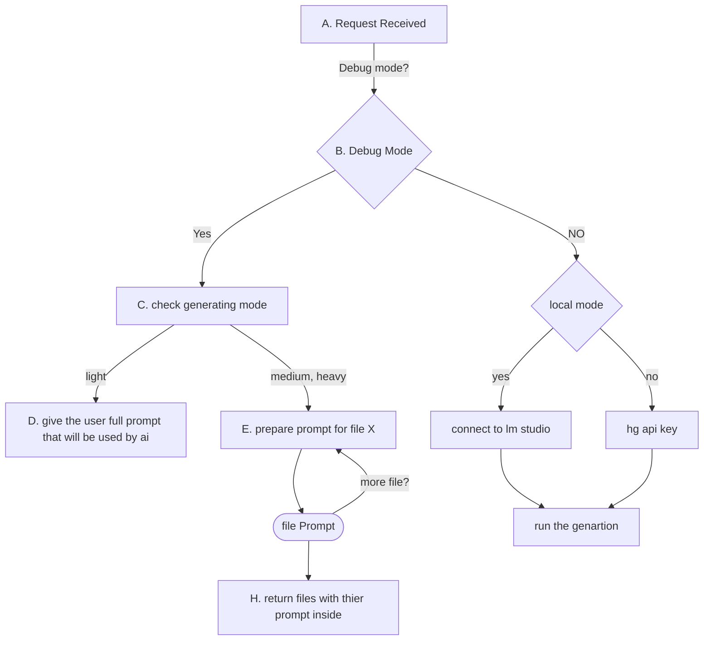

```mermaid
flowchart TD
  A[A. Request Received]
  B{B. Debug Mode}
  C[C. check generating mode]
  D[D. give the user full prompt that will be used by ai]
  E[E. prepare prompt for file X]
  F([file Prompt])
  H[H. return files with thier prompt inside ]
  I{local mode}
  J[connect to lm studio]

    A -->|Debug mode?| B
    B -->|Yes| C
    C -->|light| D
    C -->|medium, heavy| E
    E --> F
    F -->|more file?| E
    F --> H

    B -->|NO| I
    I -->|yes| J
    J --> j[run the genartion]

    I -->|no| K[hg api key]
    K --> j
```
