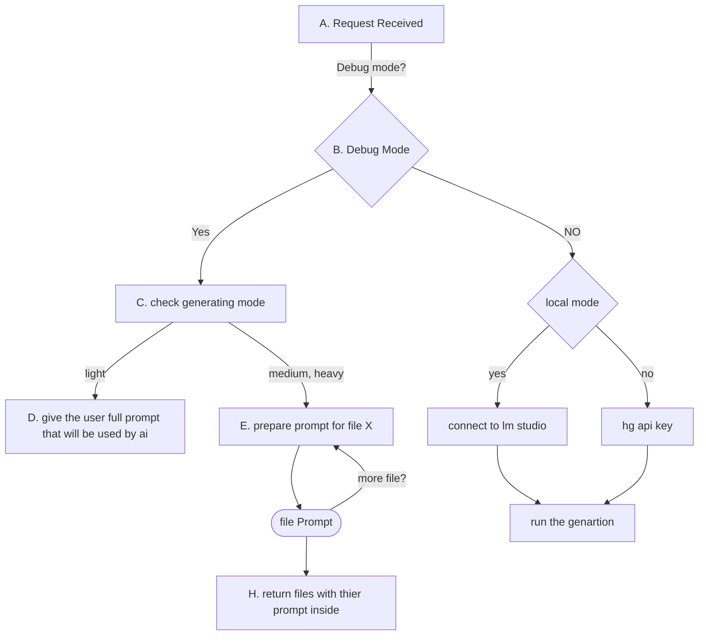

```txt
[ ← Back ]  MODE COMPLET ●
            Génération intégrale : fiche, planification, cours...
───────────────────────────────────────────────────────────────────────────────────

┌─────────────────────────────────────────┐ ┌─────────────────────────────────────┐
│ 📘 INFORMATIONS DU COURS                │ │ 🧠 STRATÉGIE & CONTEXTE             │
│                                         │ │                                     │
│  Niveau              Semestre           │ │  Profil & niveau réel des élèves    │
│  [ 1AC         ▼ ]   [ Semestre 1  ▼ ]  │ │  [ Éleves très dynamiques mais... ] │
│                                         │ │                                     │
│  Matière             Langue             │ │  Méthode Pédagogique                │
│  [ Informatique▼ ]   [ Français    ▼ ]  │ │  ( ) Expositive   ( ) Démonstrative │
│                                         │ │  ( ) Interrogative (X) Découverte   │
│  Unité / Chapitre                       │ │  ( ) RPBL       ( ) Projet          │
│  [ ex: Les fractions                 ]  │ │                                     │
│                                         │ │  Ton du Contenu                     │
│  Titre de la Leçon                      │ │  [Formal|ENGAGING|Modern|Acadimic]  │
│  [ ex: Addition et soustraction...   ]  │ │                                     │
│                                         │ │  Niveaux de Bloom                   │
│  Durée (min)      Compétences Visées    │ │  ()[Rem] -> (x)[UND] -> (x)[APP]    │
│  [ 50      ]     [ Skill 1 ][ Skill 2 ] │ │  -> ()[Anl] -> ()[EVa] -> ()[Cre]   │
└─────────────────────────────────────────┘ └─────────────────────────────────────┘
┌─────────────────────────────────────────┐ ┌─────────────────────────────────────┐
│ 📘 Style Visuel                         │ │ File to generate                    │
│ STYLE D'IMAGE                           │ │ [ ( ) { fiche } ( ) { deroulement } │
│ ( ) realistic ( ) illustration ( ) 3D   │ │ ( ) { lesson_content }              │
│ ( ) cartoon ( ) sketch ( ) minimalist   │ │ ( ) { didactic_support }            │
│                                         │ │ ( ) { mindmap } ( ) { exercises }   │
│ (*_*) Support Optionnel - preferable md │ │ ( ) { quiz } ( ) { summary }        │
│ Instructions Officielles                │ │ ( ) { slides } ( ) { images }       │
│ [ + Ajouter des instruction officielles]│ │ ( ) { videos } ( ) { scenario }  ]  │
│                                         │ │                                     │
│ Autres Fichiers de Support              │ │                                     │
│ [ + Ajouter d'Autres Support]           │ │                                     │
└─────────────────────────────────────────┘ └─────────────────────────────────────┘

───────────────────────────────────────────────────────────────────────────────────
                                        [ Cost: 15k-30k tokens ] [ VALIDER ENVOI ]
```
